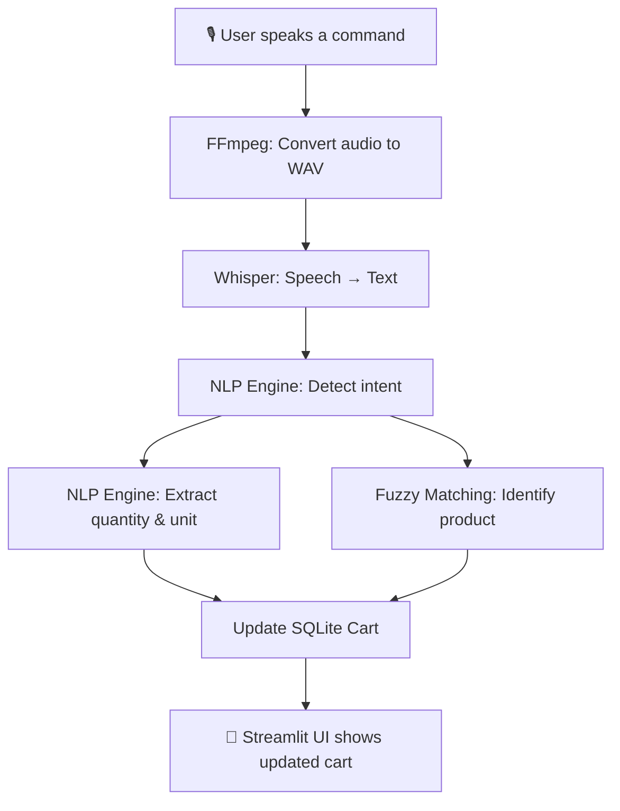

# 🛒 Voice-Based Shopping Assistant

**Speak to shop.** An AI-powered assistant that understands natural spoken commands — like *"Add 2 kg basmati rice and 1 litre milk"* — and turns them into real shopping cart actions, using speech recognition, NLP, and a live SQL-backed cart.


## 📖 Overview

Traditional online shopping means typing every item, searching, selecting quantities, and clicking "add to cart" — one product at a time. This project replaces that entire flow with **one spoken sentence**.

Say something like:

> *"Add 2 packets of rice and 1 litre milk"*

...and the assistant transcribes your speech, understands your intent, matches the products against a live catalog, and updates your cart automatically — no typing required.

This project combines **speech recognition, natural language processing, fuzzy product matching, and database-backed cart management** into one working end-to-end application.

---

## ✨ Features

- 🎤 **Live voice input** — record your command directly in the browser (or upload an audio file)
- 🧠 **Natural language understanding** — no fixed commands needed; "add rice", "I need rice", and "put rice in my cart" all work
- 🔍 **Smart product matching** — fuzzy-matches spoken words to the closest product in the catalog (e.g. "basmati" → "Basmati Rice")
- 🔢 **Quantity & unit extraction** — understands "2 kg", "one litre", "3 packets", etc.
- 🛒 **Full cart management** — add, remove, update quantities, view cart, and checkout
- 🗣️ **Multi-item commands** — a single sentence can add several products at once
- 💾 **Persistent SQL database** — products, cart, and order history are all stored in SQLite

---

## 🏗️ How It Works



**Example flow:**

| Step | Input/Output |
|---|---|
| 🎙️ Spoken | *"Add 2 kg basmati rice and 1 litre milk"* |
| 📝 Transcribed (Whisper) | `"add 2 kg basmati rice and 1 litre milk"` |
| 🧠 Parsed intent | `add` |
| 📦 Extracted items | `Basmati Rice (2 kg)`, `Milk (1 litre)` |
| 🛒 Result | Both items added to cart, total price updated |

---

## 🛠️ Tech Stack

| Layer | Technology |
|---|---|
| Speech-to-Text | [faster-whisper](https://github.com/SYSTRAN/faster-whisper) |
| Audio Processing | FFmpeg (via `imageio-ffmpeg`) |
| NLP (Intent + Entity Extraction) | Custom rule-based engine + [RapidFuzz](https://github.com/rapidfuzz/RapidFuzz) |
| Database | SQLite |
| Frontend / UI | [Streamlit](https://streamlit.io/) |
| Language | Python 3.10+ |

---

## 🚀 Getting Started

### 1. Clone the repository
```bash
git clone https://github.com/YOUR_USERNAME/voice-shopping-assistant.git
cd voice-shopping-assistant
```

### 2. Create a virtual environment
```bash
python -m venv env
env\Scripts\activate        # Windows
source env/bin/activate     # Mac/Linux
```

### 3. Install dependencies
```bash
pip install -r requirements.txt
```

### 4. Set up the database
```bash
python db_setup.py
```

### 5. Run the app
```bash
streamlit run app.py
```

The app will open at `http://localhost:8501`. Choose **🎤 Record live** to speak a command, or **📁 Upload audio file** to test with a pre-recorded clip.

---

## 🗣️ Example Commands

| You say | What happens |
|---|---|
| "Add 2 kg rice and 1 litre milk" | Adds both items to the cart |
| "I need some basmati rice" | Adds Basmati Rice to the cart |
| "Remove the milk" | Removes Milk from the cart |
| "Change rice quantity to 3" | Updates the quantity |
| "Show my cart" | Displays current cart contents |
| "Checkout" | Finalizes the order and clears the cart |

---

## 📂 Project Structure

```
voice-shopping-assistant/
├── app.py              # Streamlit UI and orchestration
├── audio_utils.py       # Audio conversion (FFmpeg) + transcription (Whisper)
├── nlp_engine.py         # Intent detection, entity extraction, product matching
├── db_setup.py             # Database schema + sample product data
├── requirements.txt
├── .gitignore
└── README.md
```

---

## 🔮 Future Improvements

- 🌐 Multilingual support (Hindi, Telugu, and more) — Whisper already supports this; the NLP layer would need extending
- 🤝 Product recommendations (e.g. "bought pasta → suggest pasta sauce")
- ❓ Disambiguation prompts when a spoken term matches multiple products
- 🧠 Upgrade the rule-based NLP layer to a trained intent-classification model
- ☁️ Persistent cloud database (currently resets on redeploy in free hosting tiers)

---

## 👤 Author

Built by **Sowjanya Parshapu** as a project combining Speech Recognition, NLP, and full-stack Python development.

Feel free to connect on https://www.linkedin.com/in/sowjanya-parshapu-8698082b6(#) or check out more of my work on https://github.com/(#).
